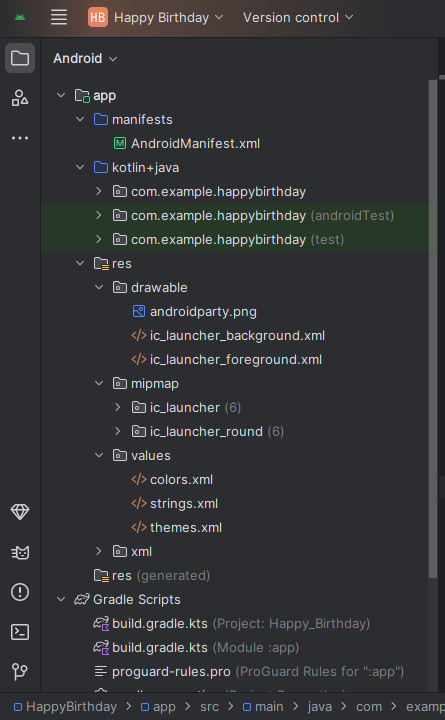

# Ejercicios 1 y 2 - IPDM Otoño 2025

Este repositorio contiene las soluciones a los ejercicios 1 y 2 del trabajo práctico de Android con Jetpack Compose.

## Ejercicio 1: Compila una app simple con elementos de texto
Se creó una app que muestra un saludo de cumpleaños usando componentes de texto (`Text`).

## Ejercicio 2: Cómo agregar imágenes a tu app
Se agregó una imagen de fondo con opacidad, se usó `Box` para superponer texto, y se alinearon todos los elementos al centro de la pantalla.

## Capturas de pantalla
A continuación se muestran capturas del emulador con la app funcionando:

